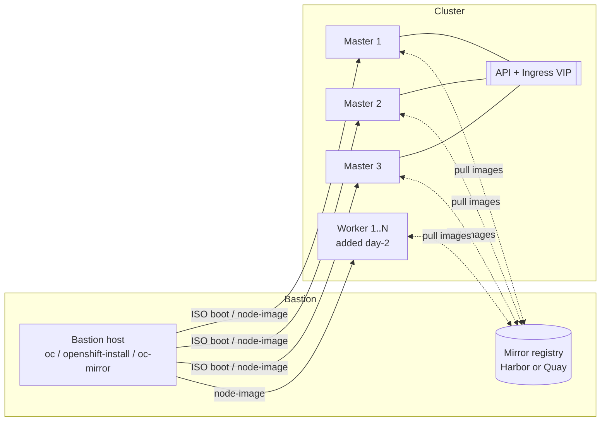

# OpenShift On-Prem Install — Agent-Based Installer

Runbook and config templates for standing up a disconnected, bare-metal OpenShift
Container Platform (OCP) cluster with the [Agent-Based Installer](https://docs.openshift.com/container-platform/latest/installing/installing_with_agent_based_installer/preparing-to-install-with-agent-based-installer.html),
backed by a local Harbor or Red Hat Quay mirror registry.

## Table of contents

**I. Overview**
- [Architecture](#architecture)
- [IP planning](#ip-planning)
- [Topology](#topology)

**II. Installing**
1. [Prerequisites — bastion host prep](docs/01-prerequisites.md)
2. [Disconnected registry setup (Harbor / Quay)](docs/02-registry-setup.md)
3. [Disconnected registry mirroring](docs/03-disconnected-mirroring.md)
4. [Installing the cluster](docs/04-cluster-install.md)
5. [Adding worker nodes (day 2)](docs/05-worker-node-addition.md)
6. [Installing ODF](docs/06-odf-storage.md)

## Architecture

- **Control plane**: 3 bare-metal masters, fixed at install time (`controlPlane.replicas: 3`).
- **Workers**: 0 at install time; added post-install as a day-2 operation via
  `oc adm node-image` (see [doc 5](docs/05-worker-node-addition.md)) so worker count/hardware
  can grow independently of the initial bootstrap.
- **Networking**: `OVNKubernetes` CNI, one routable VIP for the API and one for Ingress,
  both on the bare-metal platform integration (`platform.baremetal`).
- **Registry**: a disconnected/mirror registry (Harbor or Red Hat Quay's `mirror-registry`)
  hosts the OCP release and operator images; its CA is trusted cluster-wide via
  `additionalTrustBundle`.
- **Storage**: ODF (OpenShift Data Foundation) on labeled infra nodes, with a MachineConfig
  workaround to make virtual disks discoverable (see [doc 6](docs/06-odf-storage.md)).



## IP planning

Fill this in per environment before generating `install-config.yaml` / `agent-config.yaml`
(examples below use the documentation-only range `192.0.2.0/24`, per RFC 5737):

| Role                  | Hostname             | IP            | Notes                        |
|-----------------------|-----------------------|---------------|-------------------------------|
| Bastion / registry    | `registry.example.com`| `192.0.2.40`  | Runs Harbor/Quay + client tools |
| API VIP               | `api.hub.example.com` | `192.0.2.41`  | `platform.baremetal.apiVIP`   |
| Ingress VIP           | `*.apps.hub.example.com` | `192.0.2.42` | `platform.baremetal.ingressVIP` |
| Master 1              | `master01`            | `192.0.2.200` | Also `rendezvousIP`           |
| Master 2              | `master02`            | `192.0.2.201` |                               |
| Master 3              | `master03`            | `192.0.2.202` |                               |
| Worker N              | `computeNN`           | `192.0.2.4x`  | Added via `oc adm node-image` |

## Topology

A single L2/L3-routable subnet carries bastion, registry, control-plane and worker traffic;
the bastion node is the only host that needs external (mirrored) connectivity. See the
diagram under [Architecture](#architecture) above.

## Repository layout

```
.
├── docs/                          Step-by-step install guide (linked above)
├── configs/                       install-config / agent-config / nodes-config *.example templates
│   └── imageset/                  oc-mirror ImageSetConfigurations (release, Red Hat & certified operators)
├── manifests/                     Harbor config template + ODF non-rotational MachineConfig
├── scripts/
│   └── tune-os.sh                 Bastion OS tuning (ulimits, sysctl, timezone)
└── .gitignore                     Keeps real (secret-bearing) configs out of git
```

## Quick start

```bash
# 1. Prep the bastion
sudo ./scripts/tune-os.sh

# 2. Stand up a mirror registry — pick one, see docs/02-registry-setup.md
#    (Harbor or Red Hat Quay mirror-registry)

# 3. Mirror the release/operator images — see docs/03-disconnected-mirroring.md

# 4. Generate install-config.yaml + agent-config.yaml and build the ISO
mkdir -p openshift/install && cd openshift/install
cp ../../configs/install-config.yaml.example install-config.yaml
cp ../../configs/agent-config.yaml.example agent-config.yaml
# edit both, then:
openshift-install agent create image --dir ./install
```

Full details for every step are in [docs/](docs/), in order.

## Security note

`configs/*.example` and `manifests/harbor.yml.example` are templates only — they contain
placeholders like `<PULL_SECRET_JSON>` and `<SSH_PUBLIC_KEY>`, not real credentials. Copy
them to the non-`.example` filename to fill in real values; those real filenames are already
excluded via `.gitignore` so cluster secrets never get committed.

> This repo's history predates this reorganization and contains real secrets committed in
> earlier revisions (a pull secret, registry credentials, and an SSH key). If this repository
> is or was ever public, treat those credentials as compromised: rotate them, and consider
> scrubbing history (e.g. with `git filter-repo` or BFG Repo-Cleaner) before trusting the
> remote further.
